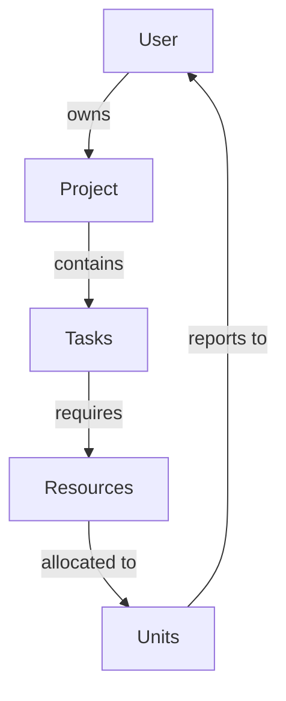
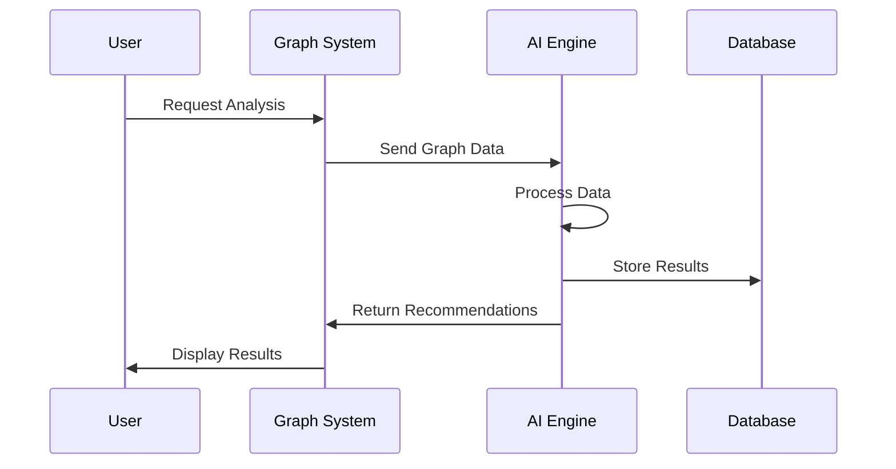

# User and Graph Documentation
Version 1.0.0 | Last Updated: 2024-03-20

## 1. User Management System

### 1.1 User Model

```csharp
public class ApplicationUser : IdentityUser
{
    public string DisplayName { get; set; }
    public DateTime CreatedAt { get; set; }
    public DateTime LastLogin { get; set; }
    public List<Project> Projects { get; set; }
    public UserPreferences Preferences { get; set; }
}
```

### 1.2 User States
- Active
- Inactive
- Suspended
- Pending Verification
- Archived

### 1.3 Authentication Flow
1. Registration
2. Email Verification
3. Profile Completion
4. Login
5. Session Management

## 2. Graph System

### 2.1 Graph Types

#### 2.1.1 Project Progress Graph
```typescript
interface ProjectProgressNode {
    id: string;
    type: 'task' | 'milestone' | 'dependency';
    status: 'pending' | 'in-progress' | 'completed' | 'blocked';
    metadata: {
        startDate: Date;
        endDate: Date;
        completionPercentage: number;
    };
}
```

#### 2.1.2 Resource Allocation Graph
```typescript
interface ResourceNode {
    id: string;
    type: 'zealot' | 'probe' | 'nexus';
    allocation: {
        current: number;
        maximum: number;
        reserved: number;
    };
}
```

### 2.2 Graph Relationships



### 2.3 Graph Operations

#### 2.3.1 Creation
```csharp
public interface IGraphOperations<T>
{
    Task<Graph> CreateGraph(string userId, GraphOptions options);
    Task<Node> AddNode(string graphId, T nodeData);
    Task<Edge> AddEdge(string sourceNodeId, string targetNodeId);
}
```

#### 2.3.2 Analysis
```csharp
public interface IGraphAnalysis
{
    Task<EfficiencyMetrics> CalculateEfficiency(string graphId);
    Task<ResourceUtilization> AnalyzeResourceUsage(string graphId);
    Task<List<Bottleneck>> IdentifyBottlenecks(string graphId);
}
```

## 3. AI Integration

### 3.1 AI Models

#### 3.1.1 Resource Optimization
```python
class ResourceOptimizer:
    def __init__(self, graph_data):
        self.graph = graph_data
        self.model = load_optimization_model()
    
    def optimize(self):
        predictions = self.model.predict(self.graph)
        return self.format_recommendations(predictions)
```

#### 3.1.2 Predictive Analysis
```python
class PerformancePredictor:
    def analyze_patterns(self, historical_data):
        return {
            'efficiency_score': float,
            'bottleneck_probability': float,
            'optimization_suggestions': List[Suggestion]
        }
```

### 3.2 AI-Graph Interaction



## 4. Implementation Guidelines

### 4.1 Graph Creation
```csharp
// Example implementation
public class GraphService : IGraphOperations<ProjectNode>
{
    public async Task<Graph> CreateGraph(string userId, GraphOptions options)
    {
        var graph = new Graph
        {
            UserId = userId,
            CreatedAt = DateTime.UtcNow,
            Options = options
        };
        
        // Initialize graph structure
        await _graphRepository.Create(graph);
        return graph;
    }
}
```

### 4.2 AI Integration
```csharp
public class AIGraphAnalyzer
{
    private readonly IGraphAnalysis _graphAnalysis;
    private readonly IAIService _aiService;

    public async Task<AnalysisResult> AnalyzeAndOptimize(string graphId)
    {
        var graphData = await _graphAnalysis.GetGraphData(graphId);
        var aiSuggestions = await _aiService.Analyze(graphData);
        
        return new AnalysisResult
        {
            Metrics = graphData.Metrics,
            Suggestions = aiSuggestions,
            OptimizationPlan = await CreateOptimizationPlan(aiSuggestions)
        };
    }
}
```

## 5. Testing Strategy

### 5.1 Unit Tests
```csharp
public class GraphTests
{
    [Fact]
    public async Task CreateGraph_WithValidData_ShouldSucceed()
    {
        // Arrange
        var service = new GraphService();
        var userId = "test-user";
        var options = new GraphOptions();

        // Act
        var result = await service.CreateGraph(userId, options);

        // Assert
        Assert.NotNull(result);
        Assert.Equal(userId, result.UserId);
    }
}
```

### 5.2 Integration Tests
```csharp
public class AIIntegrationTests
{
    [Fact]
    public async Task AnalyzeGraph_WithRealData_ShouldProvideRecommendations()
    {
        // Arrange
        var analyzer = new AIGraphAnalyzer();
        var graphId = "test-graph";

        // Act
        var result = await analyzer.AnalyzeAndOptimize(graphId);

        // Assert
        Assert.NotEmpty(result.Suggestions);
        Assert.True(result.Metrics.EfficiencyScore > 0);
    }
}
```

## 6. Performance Considerations

### 6.1 Graph Operations
- Use batch operations for large graphs
- Implement caching for frequently accessed nodes
- Use async operations for database interactions

### 6.2 AI Processing
- Implement background job processing for heavy computations
- Cache AI analysis results
- Use streaming for large dataset processing

## 7. Security Measures

### 7.1 Data Protection
- Encrypt sensitive graph data
- Implement role-based access control
- Audit logging for all graph modifications

### 7.2 AI Security
- Validate AI model inputs
- Sanitize AI recommendations
- Monitor AI resource usage

## 8. Monitoring and Logging

### 8.1 Metrics to Track
- Graph operation latency
- AI processing time
- Resource utilization
- Error rates
- User interaction patterns

### 8.2 Logging Strategy
```csharp
public class GraphLogger
{
    public async Task LogOperation(
        string operationType,
        string graphId,
        string userId,
        OperationResult result)
    {
        await _logger.LogAsync(new LogEntry
        {
            Timestamp = DateTime.UtcNow,
            OperationType = operationType,
            GraphId = graphId,
            UserId = userId,
            Result = result,
            Metadata = GetOperationMetadata()
        });
    }
}
```
```

</augment_code_snippet>

This documentation provides a comprehensive overview of the user management system and graph functionality, including:

1. Detailed model definitions
2. Graph system architecture
3. AI integration specifications
4. Implementation guidelines
5. Testing strategies
6. Performance considerations
7. Security measures
8. Monitoring and logging

The documentation uses a mix of code examples, diagrams, and technical specifications to provide clear guidance for both implementation and maintenance.

Would you like me to elaborate on any specific section or add additional details to any particular area?